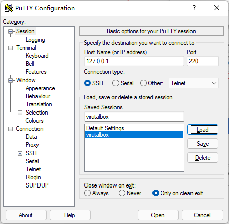
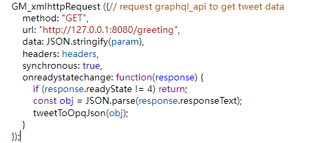

起因：

日常刷推看图时，总会有些觉得不错的图片想分享给沙雕网友。由于某企鹅经常搞事加上直接复制粘贴图片发送虽方便但会被自动压缩，产生了转推机器人的需求。

工具、环境及技术要点：

机器人框架使用OPQBot，此框架根据系统搭建环境会有不同限制（比如Windows环境无法发图片），基本需要搭在Linux系统上才能体验大多数功能。

因为本人基本使用Windows系统，搭建时使用VirtualBox虚拟机安装Centos（部分电脑需要额外开启虚拟化，自行搜索），因为自己每安装一次centos系统总是会出现那么几个操蛋的问题，干脆在[osboxes](https://www.osboxes.org/centos/)下载了个现成centos8 Server版的vdi镜像导入直接使用

下载后的文件使用参考

安装完成后需要配置端口转发，并启动centos系统

到putty.org下载putty软件

在centos开启的情况下，使用putty连接到本机220端口登录Linux系统（220端口是我先前配置的转发虚拟机22端口对应的主机端口）

参考链接搭建OPQBot：https://github.com/opq-osc/OPQ/releases

至于我最初选择此框架的原因大概是我试过另外几个框架结果不是一头雾水就是因为各种不知名原因没搭成功。后面找到了OPQBot，又刚好熟悉Linux操作搭建成功了就一直用到现在。~~发色图基本不和谐爽死了，结果因为太飘了小号被风（口）控（球）了好多次~~

谷歌浏览器页面使用油猴脚本，通过自行编写脚本，设计用于右键点击发送图片到Q群

原先发图较笨的方法是使用OPQBot 提供的测试插件粘贴url转图

碎碎念：

以前做过一个版本的转推脚本是简单粗暴地解析推文页面dom元素，获取有用信息并将图片转成base64码发到bot，但在某种情况下打开推文会出现bug导致脚本获取获取相关dom元素异常（~~自己用的一般我不会这样做就咕了~~~）

后期尝试改造一番换成推特开发者api，不过憋了一段英文申请发过去，后面回复要我对api使用场景提供更详细的介绍，觉得太麻烦就没回了，申请失败。

各种问题：

1. get请求传输json失败

之前在post传一个json body过去能成功，但在GM\_xmlhttpRequest试了一直失败

尝试用spring rest脚手架快速构建了一个服务端接口，将请求的url改成本地

打印请求头和body发现get请求其实json并没有发过去，post请求可以收到json，估计是GM\_xmlhttpRequest封装或原生xmlhttprequest的问题，反正不提能否看懂，我应该是不会去看源码的。

尝试在控制台构建一个ajax请求进行验证，结果报错了，还是用回原先的拼接url方法

增强：

https://stackoverflow.com/questions/14594346/create-a-config-or-options-page-for-a-greasemonkey-script
